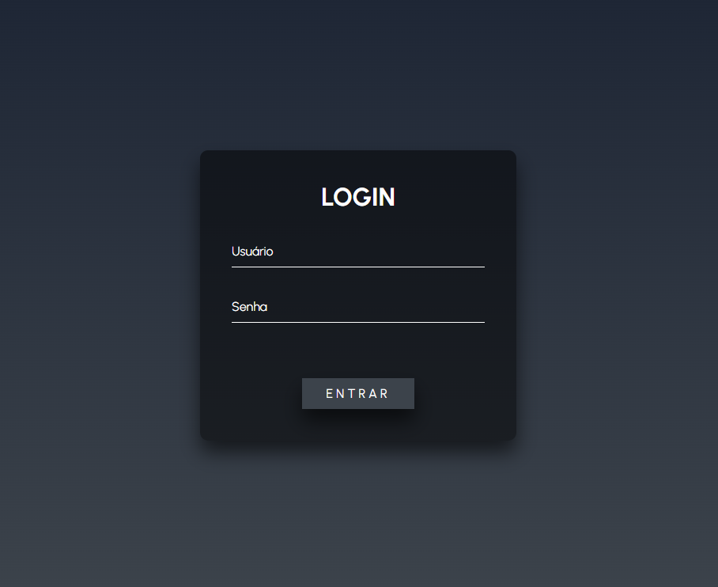
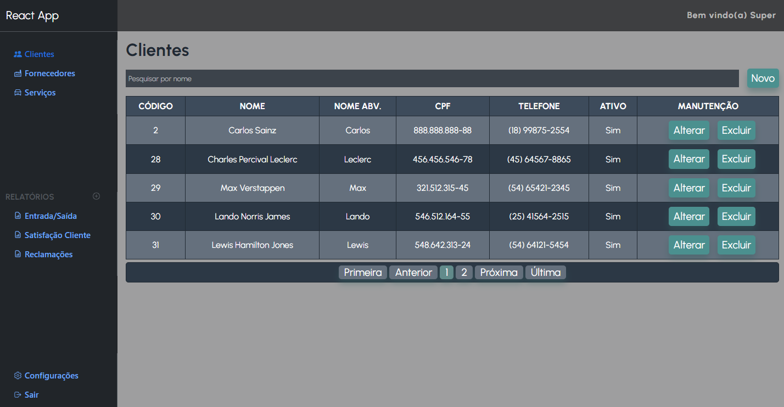

#  App React Full-Stack

 

 

Project with the objective of developing a full-stack application, using React on the front-end and Node.js on the back-end.

As this project's main focus is study, a chapter of this README will be dedicated to creating the project from scratch, with essential explanations.

## 🔧 Technologies Used 

### Front-end:


### Back-end:


### Database:


### Editor: Visual Studio Code


## 📚 Project description

The main objective of this project is to study the development of a full-stack application for the real world. The example he is based on is an ERP, which is an information system that interconnects all of an organization's data and processes into a single system.

## Project structure

```
    react-app-full-stack/
    ├── backend/
    │   ├── node_modules/
    │   ├── src/
    │   │   ├── controllers/
    │   │   ├── middlewares/
    │   │   ├── models/
    │   │   ├── routes/
    |   │   ├── utils/
    │   │   ├── config.js
    │   │   └── server.js
    │   ├── .env
    │   ├── package.json
    │   └── package-lock.json
    │
    └── frontend/
    |    ├── node_modules/
    |    ├── public/
    |    ├── src/
    |    │   ├── components/
    |    │   ├── pages/
    |    │   ├── services/
    |    │   ├── utils/
    |    │   ├── App.js
    |    │   ├── index.js
    |    │   └── index.css
    |    ├── package.json
    |    └── package-lock.json
    ├── .gitattributes
    ├── .gitignore
    ├── LICENSE
    ├── README.md
```

The **"backend"** folder contains the **Node.js** server logic and interaction with the **MySQL** database. Within it, we have the following elements:

* **node_modules**: folder where the project's dependencies are stored. Created automatically when dependencies are installed.

* **src**: folder that contains all the back-end source code.

* **controllers**: folder to store the controllers that handle HTTP requests.

* **models**: folder to store data models and interactions with the database.

* **routes**: folder to store API route and endpoint definitions.

* **config.js**: Configuration file to store sensitive information, such as database credentials.

* **server.js**: main file that starts the Node.js server and defines the routing logic.

The **"frontend"** folder contains the React application code. Within it, we have the following elements:

* **node_modules**: folder where the project's dependencies are stored. It will be created automatically when you install dependencies using npm.
* **public**: folder where you place static files, such as the main HTML file and other public resources.
* **src**: folder that contains all the front-end source code.
* **components**: folder to store reusable React components.
* **pages**: folder to store the application pages.
* **services**: folder to store communication services with the backend, such as API calls.
* **App.js**: main component that defines the structure of the React application.
* **index.js**: React application entry point.
* **index.css**: global style file for the application.

The **".gitignore"**, **"package.json"** and **"package-lock.json"** files are files required for version management and project dependencies.

## 🚀 Installation

Follow the steps below to configure and run the project locally.

### 📋 Prerequisites 

- Node.js (version 18.14.1 or higher) [download link](https://nodejs.org/)
- MySQL (version 8.0.33 or higher) [download link](https://www.mysql.com/)
- Visual Studio Code (or another editor of your choice) [download link](https://code.visualstudio.com/)

### 📥 Clone the repository

```
git clone https://github.com/seu-usuario/react-app-full-stack.git
cd react-app-full-stack
```

### ⚙️ Database Configuration

Create a MySQL database for the project.
Rename the .env.example file to .env.
Edit the .env file and enter the database information:

```
     # Node server port (backend)
     PORT="SERVID_PORT"

     # Database Settings
     MYSQL_PORT="YOUR_PORT_MYSQL"
     MYSQL_HOST="YOUR_HOST_MYSQL"
     MYSQL_USER="YOUR_USER_MYSQL"
     MYSQL_PASSWORD="YOUR_PASSWORD_MYSQL"
     MYSQL_DB="YOUR_BANK_NAME"

     # Secret key for the Token
     SECRET_KEY="NODE BACKEND/SRC/UTILS/generateSecretKey.js"
```

### 📦 Installation of dependencies

In the project root folder, run the following commands:

* Access backend folder (Node.js)

     ```
     backend cd
     ```

* Install backend dependencies (Node.js)

     ```
      npm install
     ```

* Access front-end folder (React)

     ```
     cd frontend
     ```

* Install front-end dependencies (React)

     ```
     npm install
     ```

## ▶️ Running the project

In the project root folder, run the following commands:

* Run Node.js server (backend)
     ```
     npm run start
     ```

* Run the React client (front-end)

     ```
     cd frontend
     npm run start
     ```

The server will be running at http://localhost:3333 and the React client will be running at http://localhost:3000.

## 🚀 Starting the Project from Scratch

Follow the steps below to start the project from scratch on your machine.

### 🎉 Creating the React project

To create the React project, run the following command in your terminal:

```bash
npx create-react-app react-app-full-stack
cd react-app-full-stack
```

### 🔧 Configuring the backend with Node.js

In the project root folder, create a folder for the backend:

     ```bash
     mkdir backend
     backend cd
     ```

* Start a new Node.js project:

     ```bash
     npm init -y
     ```

#### Install the required libraries for the backend:

* Installation of MySQL for Node.js:

     ```bash
     npm install mysql2
     ```

* Installation of express for Node.js:

     ```bash
     npm install express
     ```

* Installation of the bcrypt library for password encryption in Node.js:

     ```bash
     npm install bcrypt
     ```

* Installation of the jsonwebtoken library to handle JWT tokens in Node.js:

     ```bash
     npm install jsonwebtoken
     ```

* Installation of dotenv to manage environment variables in Node.js:

     ```bash
     npm install dotenv
     ```

* Cors installation to handle security policy in Node.js:

     ```bash
     npm install cors
     ```


### 🔧 Configuring the front-end


## 👥 Contribution

If you wish to contribute to this project, follow the steps below:

1. Fork the repository;

2. Create a branch for your feature:
     ```
     git checkout -b feature/feature-name
     ```
3. Make the desired changes;

4. Commit your changes:
     ```
     git commit -m 'Adding new feature'
     ```

4. Push the branch:
     ```
     git push origin feature/feature-name
     ```

5. Open a Pull Request;

## 📄 License

This project is licensed under the MIT License - see the LICENSE.md file for details.
